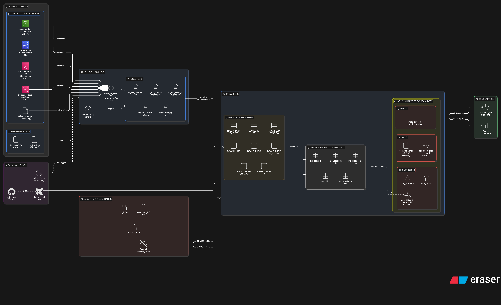
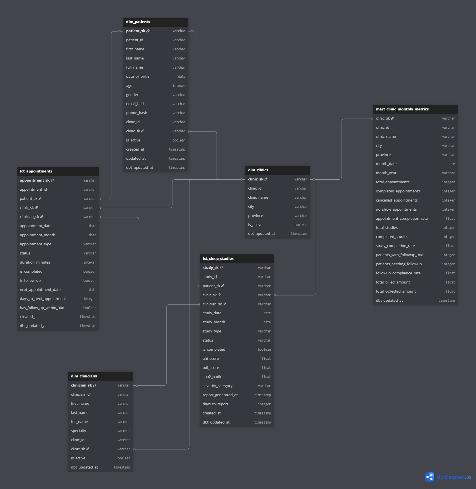
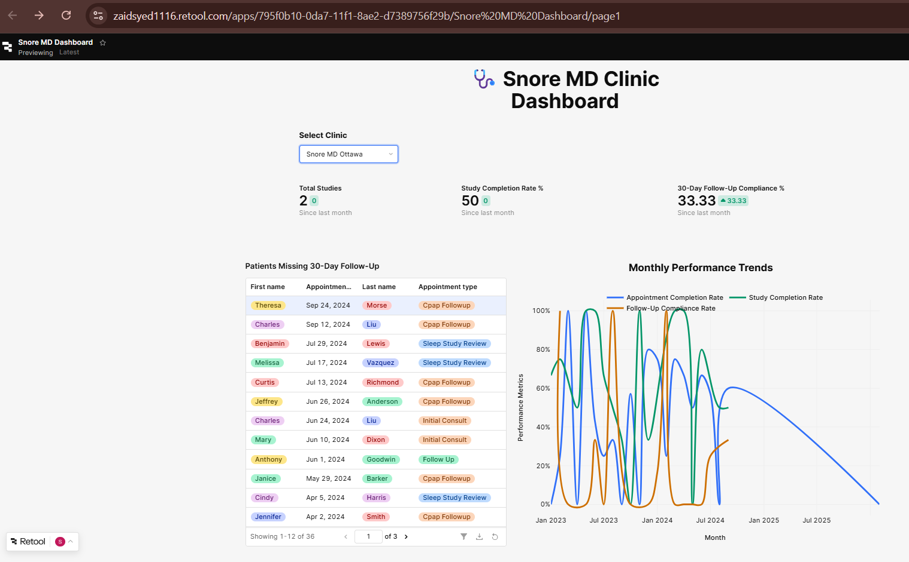

# SnoreMD Data Pipeline

## 1. Architecture Overview
Pipeline follows a **Medallion Architecture** (Bronze - Silver - Gold) across a single Snowflake data warehouse.



### Ingestion strategies
`patients.csv`: Incremental on `updated_at` - CRM data can be updated (address changes etc.) 
`appointments.json`: Incremental on `created_at` - Append-only; historical records don't change 
`sleep_studies.csv`: Incremental on `created_at` - Append-only device exports 
`clinician_notes.json`: Incremental on `created_at` - Append-only clinical notes 
`billing_report.xlsx`: Full refresh - Monthly file may contain corrections; small volume 

## 2. Tools Chosen and Why

**Why Python over AWS Glue / ADF for ingestion?**

AWS Glue requires a live AWS account, it cannot run locally and cannot be reproduced without cloud billing enabled. Python with `snowflake-connector-python` and `pandas` runs anywhere with a `pip install`, making the pipeline fully reproducible from a single `git clone`. At the data volumes in this assessment (~1,000 rows), Python is production-appropriate; at higher volumes the same ingestion logic would be wrapped in a managed service (Glue) with the dbt transformation layer unchanged. The watermark, audit logging, and incremental logic in `base_ingester.py` directly mirrors what those services implement internally.

**Why Snowflake over Redshift / Azure Synapse?**

Snowflake is cloud-agnostic, it runs natively on both AWS and Azure, making it ideal for a hybrid cloud environment. Redshift ties to AWS; Synapse ties to Azure. Snowflake's free trial also makes this assessment fully reproducible at zero cost.

**Why dbt over AWS Glue / ADF?**

dbt operates as a transformation layer on top of any SQL warehouse, no managed infrastructure needed, version-controlled in Git, and testable. Glue and ADF are better suited for complex file movement and pipeline orchestration, not SQL transformations.

## 3. Data Model Explanation

### Star Schema (ANALYTICS schema)



Three dimensions, two facts, one pre-aggregated mart.

**Dimensions**
dim_clinics — one row per clinic. Every fact table joins here. is_active allows soft-deleting a clinic without breaking historical records.

dim_patients — one row per patient. email and phone are never stored raw, only their SHA-256 hashes (PHI masking). age is derived at query time from date_of_birth so it never goes stale.

dim_clinicians — one row per clinician with their specialty and home clinic.

All three use MD5-based surrogate keys (_sk suffix) generated by dbt-utils, decoupling analytics from source system IDs.

**Facts(fields having business logic)** 
fct_appointments — one row per appointment. Joins to all three dimensions. 

Key derived fields:
is_completed -> status = 'completed'
has_follow_up_within_30d -> computed via LEAD() window function on appointment_date per patient — drives the compliance metric

fct_sleep_studies — one row per sleep study. Stores raw clinical scores (ahi_score, odi_score, spo2_nadir). severity_category (Normal / Mild / Moderate / Severe) is derived from AHI. days_to_report measures turnaround from study to report — a clinical ops KPI.

**Mart (pre-aggregated for the dashboard)**
mart_clinic_monthly_metrics — grain is one row per clinic per calendar month. Pre-aggregates appointment counts, study completion rates, follow-up compliance, and billing totals. Clinic name and location are denormalised in to avoid joins on every Retool query.

## 4. Step-by-Step Setup to run locally

### 4a. Create a Snowflake Free Trial Account

1. Log in to your Snowflake account

### 4b. Clone the Repository

```bash
git clone <repo-url>
cd snoremd_project
```

### 4c. Set Up Python Environment

```bash
python -m venv .venv
# Windows:
.venv\Scripts\activate
# macOS/Linux:
source .venv/bin/activate

pip install -r requirements.txt
```

### 4d. Configure Credentials

```bash
# Create .env file from the template
cp .env.example .env
```

Edit `.env` and fill in Snowflake credentials:

### 4e. Configure dbt Profile

```bash
# Copy the template to dbt home directory
cp dbt_project/profiles.yml.example ~/.dbt/profiles.yml
```

Edit `~/.dbt/profiles.yml` and replace all `<placeholder>` values with Snowflake credentials. The account identifier format is the same as in `.env`.

### 4f. Generate Mock Data

```bash
python data/generate_mock_data.py
```

This writes 7 files to `data/raw/`:
- `patients.csv` (~120 rows)
- `appointments.json` (~350 rows)
- `sleep_studies.csv` (~200 rows)
- `clinician_notes.json` (~160 rows)
- `billing_report.xlsx` (~220 rows)
- `clinics.csv` (5 rows)
- `clinicians.csv` (20 rows)

```bash
python run_setup.py
python -m ingestion.load_reference_tables
```

`run_setup.py` creates the Snowflake database, schemas, warehouse, and all RAW tables. `load_reference_tables` seeds the 5 clinic rows and 20 clinician rows.


## 5. Data Quality Checks

The pipeline implements **5 categories** of data quality checks via dbt:

**Null checks** `_staging_models.yml`, `_fact_models.yml` - `patient_id`, `appointment_date` must not be null 
**Uniqueness** Schema YAML - PKs (`patient_id`, `appointment_id`, etc.) must be unique 
**Referential integrity** - `_fact_models.yml` - `patient_sk` in `fct_appointments` must exist in `dim_patients` 
**Accepted values** Schema YAML - `status` must be one of `['completed', 'cancelled', 'no_show', 'scheduled']` 
**Custom business rules**  `tests/` folder - No future appointments; completion rates between 0 and 1 


## 6. How to Run the Pipeline

Run everything with a single command from the project root:

```bash
python -m ingestion.run_pipeline
```

This will:
1. Ingest all 5 source files into `SNOREMD_DB.RAW` (Bronze layer)
2. Run `dbt deps` to install dbt packages
3. Run `dbt run` to build all STAGING and ANALYTICS models
4. Run `dbt test` to execute all data quality checks
5. Print a final summary with row counts and test results


**Logs** are written to `logs/ingestion.log` for debugging.

### Demonstrating Incremental Load

To prove the watermark logic works, add new rows with today's timestamp then re-run:

```bash
python data/add_incremental_sample.py  
python -m ingestion.run_pipeline        
```

### Automated Scheduling (Continuous Pipeline)

`scheduler.py` implements automated ingestion — it continuously generates new source data and triggers the pipeline on a schedule, satisfying the "automated ingestion process" requirement.

```bash
# pipeline runs every 5 minutes (default)
python scheduler.py
```

Each scheduled run:
1. Appends new rows to source files (simulates upstream systems writing data)
2. Runs the full pipeline: ingest -> `dbt run` -> `dbt test`
3. Retool dashboard reflects the updated data automatically

Stop at any time with `Ctrl+C`.

> **Production note:** In a real deployment this scheduler would be replaced by an Airflow DAG or AWS Step Functions on a cron trigger. The pipeline logic (`run_pipeline.py`) is identical regardless of what calls it.

## 7. Retool Dashboard Setup

**Live dashboard:** https://zaidsyed1116.retool.com/embedded/public/2a457d11-f161-4d2a-96df-720616686712




## 8. Assumptions

1. **Mock data substitutes real sources.** In production, the ingestion scripts would connect to AWS RDS (PostgreSQL), a REST API endpoint, Azure Blob Storage, and AWS S3. The transformation logic is identical regardless of source.

2. **Snowflake free trial used as warehouse.** In production, this would be a provisioned Snowflake account on AWS/Azure, or Redshift/Synapse depending on existing cloud strategy. The dbt models are warehouse-agnostic SQL.

3. **PHI masking via SHA-256 hashing.** Email and phone are hashed in the `dim_patients` analytics layer. The raw data in `RAW.PATIENTS` is intended to be access-controlled via Snowflake role-based access (RBAC). In production, column-level masking policies would be applied.

4. **Incremental loads assume append-only sources.** The watermark approach works correctly when `created_at` is set at insert time and never backfilled. For late-arriving data, a merge (upsert) strategy would be more appropriate.

5. **Single-file mock sources.** In production, the scheduling API would be polled via HTTP, Azure Blob Storage would be scanned for new files, and billing Excel would be pulled from a shared drive or email attachment processor.

6. **Clinics and clinicians are static reference data.** They are seeded once. In production, these would be managed as slowly-changing dimensions (SCD Type 2) if clinic or clinician details change over time.

---

## 9. Limitations

1. **No managed orchestration platform.** The pipeline is triggered by a local scheduler (`scheduler.py`) rather than a cloud-native DAG runner. A production deployment would replace this with an Airflow DAG, AWS Step Functions, or Prefect flow on a cron schedule.

2. **No CDC (Change Data Capture).** For the PostgreSQL CRM source, production would use AWS DMS to capture row-level changes, rather than full-file CSV exports.

3. **CI/CD implemented via GitHub Actions.** The workflow in `.github/workflows/dbt_ci.yml` runs `dbt run` and `dbt test` automatically on every push to `main` and on every pull request. Snowflake credentials are stored as GitHub repository secrets.

4. **RBAC and PHI masking implemented.** `snowflake_setup/rbac.sql` creates `DE_ROLE`, `ANALYST_ROLE`, and `CLINIC_ROLE` with least-privilege grants, and applies Snowflake Dynamic Data Masking policies to `email_hash`, `phone_hash`, and `date_of_birth` in `dim_patients`. Non-DE roles see `****MASKED****` instead of real values.

5. **Billing is a full refresh.** If the billing Excel file grows large or contains multi-year history, a smarter merge-based strategy on `billing_id` would be needed.
